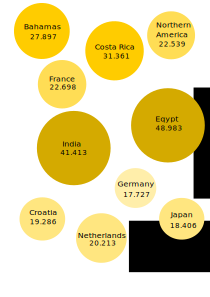
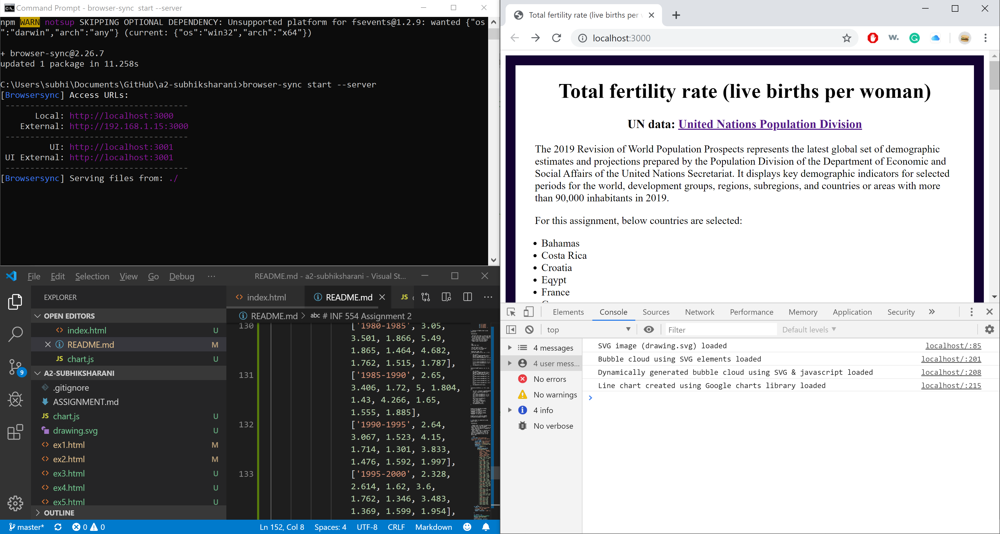

# INF 554 Assignment 2

Name: Subhiksha Rani
USC ID: 9907399097
Email: rani@usc.edu

Link to datasource: http://data.un.org/Data.aspx?q=fertility+rate&d=PopDiv&f=variableID%3a54
Link to google sheets: https://docs.google.com/spreadsheets/d/1RJh4qlPqM-Sv4HfZpRs8C_TJnua1-KRQUCEcgiTLqMA/edit#gid=380903054


1. Creation of Bubble chart using Inkscape :

 Explanation :
- Create Bubbles for each of the ten countries with their radii proprtional to the fertility rate of the countries for the year 1970-2030
- Add Country names and total fertility rate as labels on the Bubbles
- This chart is then embeded in index.html as an image

```html
code: 
```


2. Creation of Bubble chart using SVG elements in html code

 Explanation:
- Recreate SVG code in html by referring to the code developed by Inkscape
- Add circle, ellipse and text elements in the index.html
- Each circle element consists of cx,cy,r and fill attributes
- Each ellipse element consists of cx,cy,rx,ry and fill attributes
- Each text element consists of x,y,fill and font style attributes

```html
<svg width="400" height="600" viewBox="0 0 210 297">
            <circle
                style="fill:#ffdd55;stroke-width:0.26458332"
                id="circle1"
                cx="62.091198"
                cy="84.244186"
                r="24.237722" />
            
            <text id="t1" x="49.017944" y="82.538948" style="font-size:9px;">France</text>
            <text id="t2" x="50.514877" y="91.491066" style="font-size:8px;">22.698</text>
            
            <ellipse
                style="fill:#ffdd55;stroke-width:0.26174653"
                id="circle2"                
                cx="171.10434"
                cy="35.307095"
                rx="23.954241"
                ry="24.001488" />
```

3. Creation of Bubble chart using javascript :

 Explanation:

 - Recreate SVG code in javascript and call the javascript code in index.html
 - Javascript code is saved in chart.js
 - Write javascript functions to create circles and text elements
 - Sample code is pasted below

 ```
 html
 index.html <br>

 <svg id="chart"></svg>
 <script type="text/javascript" src="chart.js"></script>

 Javascript code: <br>
 function drawCircle(cx, cy, r, fill)
{
    var circle = document.createElementNS("http://www.w3.org/2000/svg","circle");
    circle.setAttributeNS(null,"cx",cx);
    circle.setAttributeNS(null,"cy",cy);
    circle.setAttributeNS(null,"r",r);
    circle.setAttributeNS(null,"fill",fill);
    svg.appendChild(circle);
}

function drawEllipse(cx, cy, rx, ry, fill)
{
    var ellipse = document.createElementNS("http://www.w3.org/2000/svg","ellipse");
    ellipse.setAttributeNS(null,"cx",cx);
    ellipse.setAttributeNS(null,"cy",cy);
    ellipse.setAttributeNS(null,"rx",rx);
    ellipse.setAttributeNS(null,"ry",ry);
    ellipse.setAttributeNS(null,"fill",fill);
    svg.appendChild(ellipse);
}

function writeText(x, y, fill, size, val)
{
    var text = document.createElementNS("http://www.w3.org/2000/svg", "text");
    text.setAttributeNS(null,"x",x);
    text.setAttributeNS(null,"y",y);
    text.setAttributeNS(null,"fill",fill);
    text.setAttributeNS(null,"font-size",size);
    text.setAttributeNS(null,"font-family","Calibri");
    text.innerHTML = val;
    svg.appendChild(text);
}


drawCircle(62.091198,84.244186,24.237722,"#ffdd55");
writeText(49.017944,82.538948,"#000000", 9,"France");
writeText(50.514877,91.491066,"#000000", 8,"22.698");

drawEllipse(171.10434,35.307095,23.954241,24.001488,"#ffdd55");
```

4. Line chart in javascript using Google Charts :

 Explanation:

 - Google chart is drawn by populating the data table from the google sheet.The curve-type option is set to "none".Hovering option is enabled to display tooltips.
 - NOTE: Google sheet is shared with "anyone in USC" and it cannot be accessed in googlecharts.Thus the data is hardcoded as seen in the below code.

 ```html
 <script type="text/javascript" src="https://www.gstatic.com/charts/loader.js"></script>
        <script type="text/javascript">
        google.charts.load('current', {'packages':['corechart']});
        google.charts.setOnLoadCallback(drawChart);
        function drawChart(){
             var data = google.visualization.arrayToDataTable([
                ['Year(s)',	'Bahamas','Costa Rica','Croatia','Egypt','France','Germany','India','Japan','Netherlands','Northern America'],
                ['1970-1975', 3.54, 4.059, 1.976, 6, 2.308, 1.708, 5.41, 2.134, 2.1, 2.024],
                ['1975-1980', 2.95, 3.704, 1.899, 5.7, 1.861, 1.508, 4.974, 1.831, 1.598, 1.768],
                ['1980-1985', 3.05, 3.501, 1.866, 5.49, 1.865, 1.464, 4.682, 1.762, 1.515, 1.787],
                ['1985-1990', 2.65, 3.406, 1.72, 5, 1.804, 1.43, 4.266, 1.65, 1.555, 1.885],
                ['1990-1995', 2.64, 3.067, 1.523, 4.15, 1.714, 1.301, 3.833, 1.476, 1.592, 1.997],
                ['1995-2000', 2.328, 2.614, 1.62, 3.6, 1.762, 1.346, 3.483, 1.369, 1.599, 1.954],
                ['2000-2005',1.87,2.15,1.41,3.15,1.882,1.351,3.14,1.298,1.74,1.991],
                ['2005-2010',1.91,1.94,1.522,3.02,1.977,1.362,2.796,1.339,1.746,2.015],
                ['2010-2015',1.81,1.851,1.488,3.45,1.981,1.427,2.396,1.409,1.732,1.849],
                ['2015-2020',1.76,1.764,1.446,3.33,1.852,1.586,2.24,1.37,1.66,1.753],
                ['2020-2025',1.709,1.682,1.407,3.131,1.848,1.612,2.139,1.367,1.68,1.755],
                ['2025-2030',1.68,1.623,1.409,2.962,1.844,1.632,2.054,1.401,1.696,1.761]
            ]);
      var options = {
        title: 'Total Fertility Rate (live births per woman)',
        curveType: 'none',
        legend: { position: 'right' },
        
      };

      var chart2 = new google.visualization.LineChart(document.getElementById('chart1'));
      chart2.draw(data, options);
    }
    </script>
    
```

5. Node js Browser sync option is used in this assignment


